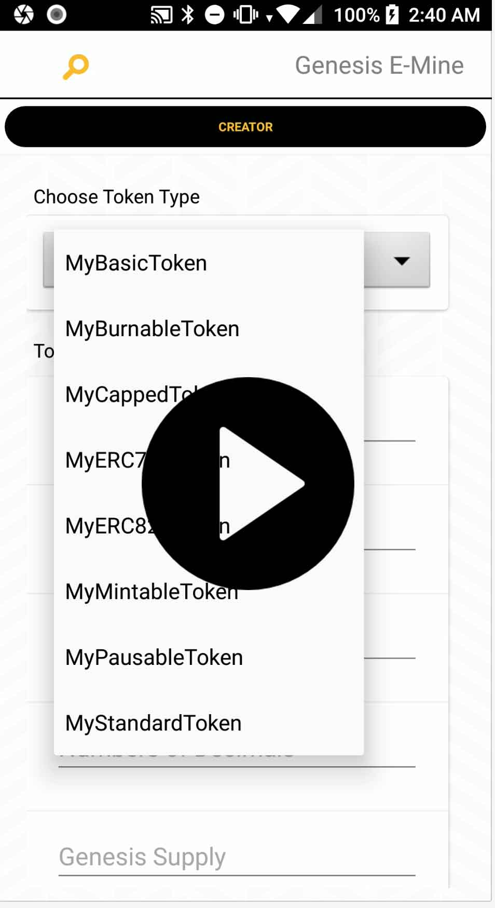

# E-Mine Token Generator

This project was created at BIOTS 2018, a hackathon about blockchain and IOT hosted at ETH Zurich.
**The complete project documentation is available [here](https://github.com/e-mine1/e-mine-web/blob/master/docs/E-Mine1%20project%20documentation.pdf).**

E-Mine Token Generator is a web service through which users can submit requests for creation and deployment of their smart contracts on the [Ethereum](https://www.ethereum.org/) network. It is built using [Flask](http://flask.pocoo.org/) and can be accessed through a REST API. User makes a request for a smart contract and provides relevant parameters. E-Mine Token Generator then prepares an actual smart contract by filling a template of [Solidity](https://solidity.readthedocs.io/en/develop/) code, compiles it and broadcasts it on Ethereum network. Currently it supports compilation and deployment of several standard tokens which are available in [OpenZeppelin](https://openzeppelin.org/) framework. For compilation and deployment on the server side we used [Truffle](http://truffleframework.com/) - a [Node.js](https://nodejs.org/en/) based development framework for Ethereum smart contracts. In order to test our system we set up a local Ethereum network using [Ganache](http://truffleframework.com/ganache/), a tool which is a part of the Truffle framework. Ganache features an internal Javascript implementation of Ethereum blockchain, as well as built-in blockchain explorer that allows easy testing and debugging of distributed applications.


## Token Templates

As a basis for token creation we use [OpenZeppelin](https://github.com/OpenZeppelin/zeppelin-solidity), a framework to build secure smart contracts on Ethereum.
For each token type a template is provided, implemented as an extended class of corresponding OpenZeppelin token implementation.
Following [token templates](https://github.com/e-mine1/e-mine-web/tree/master/solidity_assets/zeppelin_contracts/Emine_templates) are provided:

| Standard |      Token              | Description                                                                  |
|:-------- |:----------------------- |:---------------------------------------------------------------------------- | 
| ERC20    | Standard token          | Implementation of the basic standard token                                   |
|          | Basic token             | Standard token with no allowances                                            |
|          | Pausable token          | Standard token modified with pausable transfers                              |
|          | Mintable token          | A Simple ERC20 with mintable token creation                                  |
|          | Capped token            | Mintable token with a token cap                                              |
|          | Burnable token          | Token that can be irreversibly burned (destroyed)                            |
| ERC721   | Generic ERC721 token    | Generic implementation for the required functionality of the ERC721 standard |
| ERC827   | Generic ERC827 token    | ERC827 implementation - ERC20 standard with extra methods to transfer value  | 
|          |                         | and data and execute calls in transfers and approvals                        |

Each template contains placeholders for custom user parameters provided by the client application. Currently, the 
following parameters are supported
* *Token name* - Name of a token.
* *Token symbol* - Symbol representing the token.
* *Decimals* - Divisibility of a token, i.e. number of decimal places when displaying token value.
* *Initial supply* - Initial supply of tokens.

E.g. following code snippet shows placeholders for the Standard token template:

```
string public constant name = "%token_name%";
string public constant symbol = "%token_symbol%"; 
uint8 public constant decimals = %token_decimals%;
uint256 public constant INITIAL_SUPPLY = %token_initial_supply%;
```

Provided values can then be used in smart contract functions, such as in the following example of *MyStandardToken()* constructor that gives initial coin supply to *msg.sender*:

```
function MyStandardToken() public {
   totalSupply_ = INITIAL_SUPPLY;
   balances[msg.sender] = INITIAL_SUPPLY;
   Transfer(0x0, msg.sender, INITIAL_SUPPLY);
}
```

Each template can be easily extended to introduce new smart contract (token) parameters and functions according to the specific user requirements.

## REST API

REST API is implemented as a [python script](https://github.com/e-mine1/e-mine-web/blob/master/emine_web.py) with the following supported operations:

| API URL            | Method  | Required/Optional variables | Expected response                            |
|:------------------ |:-------:|:--------------------------- |:-------------------------------------------  | 
| /api/requests/<id> | GET     | id=[uuid]                   |                                              |
| /api/tokens/types  | GET     |                             | { "types": [                                 |
|                    |         |                             |    "MyBasicToken",                           |
|                    |         |                             |    "MyBurnableToken",                        |
|                    |         |                             |    "MyCappedToken",                          |
|                    |         |                             |    "MyERC721Token",                          |
|                    |         |                             |    "MyERC827Token",                          |
|                    |         |                             |    "MyMintableToken",                        |
|                    |         |                             |    "MyPausableToken",                        |
|                    |         |                             |    "MyStandardToken" ]}                      |
| /api/tokens/create | POST    | tokenName=[string]          | {"created": [datetime],                      |
|                    |         | symbol=[string]             |  "key": [uuid],                              |
|                    |         | maxSupply=[integer]         |  "status":                                   |
|                    |         | decimals=[integer]          |     "success" or "pending" or "failure",     | 
|                    |         | genesisSupply=[integer]     |  "token_abi": [base64 encoded JSON value],   |
|                    |         |                             |  "token_addr",                               |
|                    |         |                             |  "updated": [datetime],                      |
|                    |         |                             |  "version": 1}                               |
|                    |         |                             |                                              |

The endpoint `/api/tokens/create` is called to compile and deploy a new smart contract to the network. With the `key` 
field of the response, the endpoint `/api/requests/<key>` can be called to obtain status results.
On deployment success, the response contains the contract address (`token_addr`) and token ABI (`token_abi`).

### HTTP Return code conventions
Response code for successfull requests are always 200. 
If a response code is not 200, the json response contains a field `error` with the error message.

## Mobile Client
We extended an existing Android application (see https://github.com/e-mine1/GenesisApp) to test the API.
A demo video can be seen below.

<a href="https://drive.google.com/open?id=1nSEx-kJofXpJGVF96o5UcC-vv0UKdlrh">
   </a>

## Installation

### Installing Prerequisites
- Python3+, pip3
- nodejs, npm
- Ganache: http://truffleframework.com/ganache/

```bash
# install pip dependencies
$ pip install -r requirements.txt
   
# install truffle
$ npm install -g truffle
````

### Running the Backend
```
# fire up local dev server
$ ./run.sh

# run Ganache
```
The E-Mine REST API is exposed at localhost:5000/api/.

### Source Files
- `emine_web.py`: REST backend
- `solc_compile_deploy.py`: modules to compile and deploy contracts
- `db.py`: database wrapper
